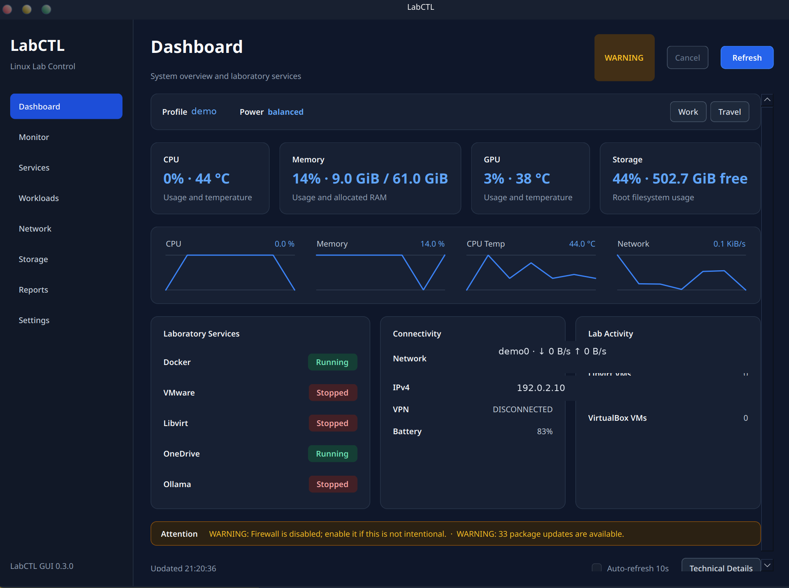

# LabCTL

LabCTL is a modular workstation management and diagnostics toolkit for Ubuntu/Kubuntu and Fedora-based cybersecurity workstations.

It provides a single command-line interface for checking workstation health, managing laboratory services, inspecting hardware, and controlling virtualization and cloud-related tools without replacing standard Linux utilities.

## Development status

Current development version:

    2.3.0-dev

Latest stable release:

    2.2.0

## Requirements

See [REQUIREMENTS.md](REQUIREMENTS.md) for supported distributions, CLI and GUI dependencies, optional integrations, and build packages.

## Core commands

    labctl health
    labctl doctor
    labctl about
    labctl info
    labctl modules
    labctl version
    labctl help

### Command overview

- `health` shows a quick workstation health summary.
- `doctor` runs detailed workstation diagnostics and recommendations.
- `about` shows LabCTL, Git repository, and platform information.
- `info` is an alias for `about`.
- `modules` lists the installed LabCTL modules.
- `version` prints the current LabCTL version.
- `help` displays general usage and available modules.

## Current modules

1. battery
2. docker
3. doctor
4. firewall
5. gpu
6. libvirt
7. monitor
8. network
9. ollama
10. onedrive
11. power
12. profile
13. sensors
14. virtualbox
15. vm
16. vmware

The internal `utils` module provides shared output and formatting functions and is not listed as a user-facing module.

## Examples

    labctl about
    labctl doctor
    labctl battery status
    labctl docker status
    labctl firewall status
    labctl gpu status
    labctl libvirt status
    labctl network list
    labctl onedrive status
    labctl ollama status
    labctl vm list
    labctl vmware status
    labctl monitor dashboard
    labctl monitor dashboard --json

Preview and apply a workstation configuration safely:

    labctl work qemu docker --dry-run
    labctl work qemu docker
    labctl work qemu docker --yes

When an active component would be stopped, LabCTL asks for confirmation. Use `--dry-run` to inspect the plan or `--yes` for intentional non-interactive operation. If applying a component or power profile fails, LabCTL attempts to restore the previous state.

## Diagnostic output

The `doctor` command uses four diagnostic result levels:

- `PASS` — the check completed successfully.
- `INFO` — informational data that does not indicate a problem.
- `WARNING` — an item that may require attention.
- `ERROR` — a failed or critical check.

The final system health classification is one of:

- `EXCELLENT`
- `HEALTHY`
- `ATTENTION NEEDED`
- `CRITICAL`

Color output is enabled automatically when LabCTL is connected to an interactive terminal. ANSI color codes are omitted when output is redirected to a file or pipeline.

## Platform compatibility

LabCTL detects the available platform tools instead of requiring a single Linux distribution:

- Ubuntu and Kubuntu use APT, UFW, and AppArmor when available.
- Fedora uses DNF, Firewalld, and SELinux when available.
- KDE Plasma does not require special configuration; the CLI works independently of the desktop environment.
- Libvirt, Docker, VMware, VirtualBox, Ollama, and OneDrive remain optional and are detected at runtime.

Some status and management commands require `sudo`, depending on the service and distribution configuration.

The optional Qt GUI provides separate monitoring, service, network, storage, diagnostics, and platform-information pages. Graphical service actions use KDE's PolicyKit authentication dialog rather than an interactive terminal prompt.

Its dashboard summarizes health, active profile, power mode, CPU/GPU temperatures, memory, storage, network, VPN, battery, virtual workloads, firewall, and cached package updates. Five-minute in-memory graphs show recent CPU, memory, temperature, and network activity. Technical command output remains available through a collapsible details panel.

`labctl monitor dashboard --json` provides the versioned machine interface consumed by the GUI. Schema version 1 includes resource measurements, services, security state, alerts, and a read-only Docker/Libvirt/VMware/VirtualBox workload inventory. The normal dashboard remains intended for people and can evolve independently.

Package-update results are cached for one hour and workload inventory for 20 seconds. Override these intervals with `LABCTL_UPDATE_CACHE_TTL` and `LABCTL_WORKLOAD_CACHE_TTL` respectively.

Dashboard alert thresholds can be customized by copying `config/alerts.conf.example` to `~/.config/labctl/alerts.conf`. Temperature and storage alerts use configurable hysteresis to prevent rapid state changes near a threshold. Set `LABCTL_ALERT_CONFIG` to use a different configuration file.

## Project structure

    Linux_Services/
    ├── labctl
    ├── labctl.health.backup
    ├── lab-ai
    ├── lab-docker
    ├── lab-vmware
    ├── modules/
    │   ├── battery.sh
    │   ├── docker.sh
    │   ├── doctor.sh
    │   ├── firewall.sh
    │   ├── gpu.sh
    │   ├── libvirt.sh
    │   ├── monitor.sh
    │   ├── network.sh
    │   ├── ollama.sh
    │   ├── onedrive.sh
    │   ├── power.sh
    │   ├── profile.sh
    │   ├── sensors.sh
    │   ├── utils.sh
    │   ├── virtualbox.sh
    │   ├── vm.sh
    │   └── vmware.sh
    ├── gui/
    ├── config/
    ├── tests/
    ├── reports/
    ├── README.md
    ├── CHANGELOG.md
    ├── LICENSE
    └── .gitignore

`labctl.health.backup` is retained temporarily for the current `health` implementation and is planned for refactoring in a later development phase.

## Validation

Validate the main executable and the current health script:

    bash -n labctl
    bash -n labctl.health.backup

Validate every module:

    for file in modules/*.sh; do
        echo "Checking: $file"
        bash -n "$file" || exit 1
    done

Run basic functional checks:

    ./labctl version
    ./labctl about
    ./labctl info
    ./labctl modules
    ./labctl doctor
    ./labctl help

Run the automated CLI test suite:

    ./tests/test_cli.sh
    ./tests/test_profile.sh
    ./tests/test_privilege.sh

The CLI, profile safety, and GUI navigation suites are registered with CTest when the GUI is configured with `BUILD_TESTING=ON`.

## Development workflow

LabCTL development uses feature branches and pull requests to keep `main` stable.

    git switch -c feat/example

    # Modify and validate complete files.

    git add <files>
    git commit -m "feat(scope): describe the change"
    git push -u origin feat/example

Create and review a pull request before merging the branch into `main`.

## Design principles

- LabCTL focuses on Ubuntu/Kubuntu and Fedora cybersecurity workstation administration.
- Modules should provide workflow-specific value rather than duplicate standard Linux commands.
- User-facing output and documentation are written in English.
- Modules use a common dispatch pattern and shared output functions.
- Potentially destructive operations should require clear confirmation.
- Redirected output must remain free of terminal color escape sequences.

## Roadmap

Planned development priorities include:

- Refactor the legacy health implementation.
- Expand automated tests with mocked service backends.
- Generate workstation reports.
- Add hardware and software inventory reporting.
- Add firmware, Flatpak, Snap, and reboot-status update checks.

## License

LabCTL is distributed under the MIT License. See `LICENSE` for the complete license text.
